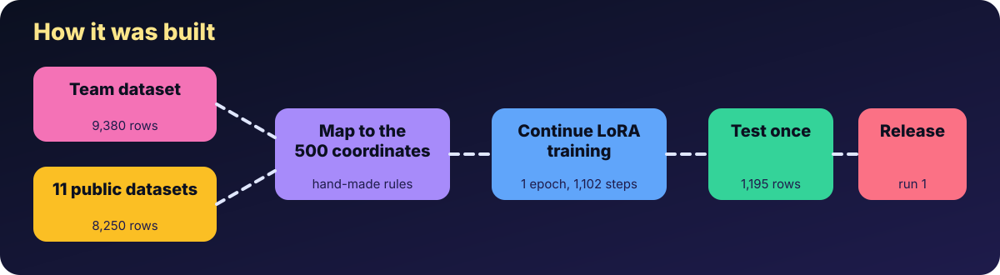

# 🌌 Elysium X 500 FR

    

A small model that reads a short chat and says **which of 500 emotions** the last line shows, and how strongly. Built by OpenNHE Technologies (Project NHE).

> Licence: **CC BY-NC-SA 4.0** (non-commercial). Research release. Not "open source" in the strict sense.

## 💬 In plain words

You give it a short conversation. It answers with a small JSON note such as `{"dimensions":[{"id":1,"strength":0.5}]}`, meaning "coordinate 1 (joy), medium strength". There are 500 such coordinates, grouped into families like positive feelings, fear, anger and so on (`taxonomy_500.csv`).

## 📊 How good is it

Exact match on a private test set of 1,195 rows (the labels and strengths must all match).

| Test slice | Original | This release | Change |
|---|---|---|---|
| **No emotion name in the text (n=403), the hard one** | 19.35% | **23.33%** | +3.98 |
| All rows | 69.54% | **70.71%** | +1.17 |
| Emotion name in the text (n=792) | 95.08% | 94.82% | -0.26 (2 of 792) |

We aimed to beat all three original numbers. This release beats two and misses the third by 2 answers, and we publish it anyway. A repeat run had a training-loop bug and scored lower; it is not the release. Details in the paper.

What it means: with the giveaway word hidden it gets about 1 in 4 right. With the word present it is right about 19 times in 20. Treat the low number as the honest one.

## 📁 Files

| File | What it is |
|---|---|
| `Elysium_X_500_FR_continued_training.pdf` | Technical report: continued training on public emotion datasets (DOI 10.5281/zenodo.23179294; cites the original, DOI 10.5281/zenodo.23159402) |
| `Elysium_X_500_FR_layman_guide.pdf` | A short guide for non-experts |
| `public_data_mapping.csv` | How each public dataset's labels map to the 500 coordinates |
| `taxonomy_500.csv` | The 500 coordinates with definitions |
| `eval_test.json`, `eval_dev.json` | Full measured results |

Weights, GGUF and the dataset live on Hugging Face:
- Model: https://huggingface.co/open-nhe/Elysium-X-500-FR
- GGUF (Q8_0, not separately scored): https://huggingface.co/open-nhe/Elysium-X-500-FR-GGUF
- Dataset: https://huggingface.co/datasets/open-nhe/elysium-x-500-fr-dataset

## 📚 Data and licences

Trained on the team dataset (CC BY-NC-SA 4.0) plus rows from: GoEmotions (Apache-2.0), BRIGHTER (CC BY 4.0), EmpatheticDialogues (CC BY-NC 4.0), XED (CC BY 4.0), SemEval-2018 Task 1 (licence unknown), daily_dialog (CC BY-NC-SA 4.0), ISEAR (not stated), dair-ai/emotion ("other"), tweet_eval (unknown), Chinese Multi-Emotion Dialogue (MIT). Base model Qwen2.5-1.5B-Instruct (Apache-2.0). Because some licences are unknown or non-commercial, this is for non-commercial research only. Owners can ask for removal.

## ⚠️ Limits

Synthetic, templated team data; labels are human-monitored, not gold; one run per setting, no confidence intervals; weak on Hindi and Bengali without the emotion word. Not for medical, mental-health or profiling use.

## 💜 Credit

OpenNHE Technologies, Project NHE.
